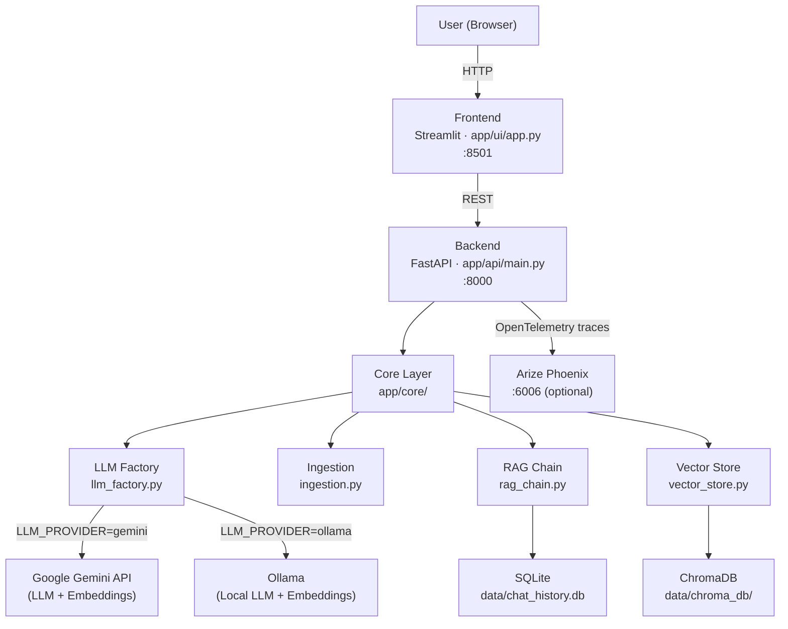
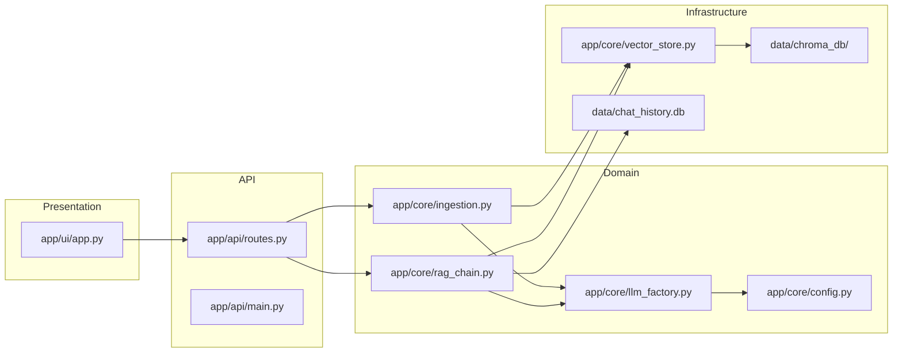

# Architecture

## System Overview



The system is a **monolithic RAG application** composed of three layers: a Streamlit frontend, a FastAPI backend, and a core library that handles ingestion, retrieval, and generation. The backend communicates with ChromaDB for vector storage, SQLite for chat history persistence, and either Google Gemini or a local Ollama instance for LLM inference and embeddings.

---

## Key Design Decisions

1. **Provider-agnostic LLM/Embeddings via factory pattern** (`llm_factory.py`): `get_llm()` and `get_embeddings()` return LangChain-compatible objects regardless of which provider is active. The active provider is selected at runtime via the `LLM_PROVIDER` environment variable, making it easy to swap between cloud (Gemini) and local (Ollama) without touching chain logic.

2. **LangChain LCEL for RAG chain construction** (`rag_chain.py`): The pipeline is built with LangChain Expression Language using `RunnableParallel` and `RunnableWithMessageHistory`. This keeps retrieval and generation declarative and makes the chain composable.

3. **SQLite for persistent chat history** (`rag_chain.py`): `SQLChatMessageHistory` from `langchain_community` stores per-session conversation history in `data/chat_history.db`. This allows history to survive API restarts without requiring a separate database service.

4. **pydantic-settings for configuration** (`config.py`): All settings are typed via `BaseSettings` with a `@model_validator` that enforces `GOOGLE_API_KEY` presence when `LLM_PROVIDER=gemini`. Configuration is loaded from `.env` at startup.

5. **Optional tracing with graceful degradation** (`api/main.py`): Phoenix/OpenTelemetry instrumentation is wrapped in a `try/except`. If Phoenix is not running, a warning is emitted and the API starts normally — tracing is never a hard dependency.

6. **ChromaDB with local persistence** (inferred from `vector_store.py`): The vector store is initialized with a filesystem persist directory (`data/chroma_db/`). No separate service is required, keeping the setup simple for a POC.

---

## Codebase & Directory Map

```
rag-lab/
├── app/
│   ├── api/            # FastAPI app and route handlers
│   │   ├── main.py     # App factory, Phoenix instrumentation
│   │   └── routes.py   # /ingest, /chat, /history endpoints + Pydantic models
│   ├── core/           # Business logic (provider-independent)
│   │   ├── config.py       # pydantic-settings Settings class
│   │   ├── ingestion.py    # File loading, chunking, embedding pipeline
│   │   ├── llm_factory.py  # LLM + Embeddings factory (Gemini / Ollama)
│   │   ├── rag_chain.py    # LCEL RAG chain + SQLite chat history
│   │   └── vector_store.py # ChromaDB wrapper
│   └── ui/
│       └── app.py      # Streamlit frontend
├── data/               # Runtime data (gitignored)
│   ├── chroma_db/      # ChromaDB vector store persistence
│   └── chat_history.db # SQLite chat history
├── docs/               # Technical documentation
├── .env.example        # Environment variable template
├── Makefile            # Service launchers (make api / ui / phoenix)
└── pyproject.toml      # Python dependencies (Poetry)
```


