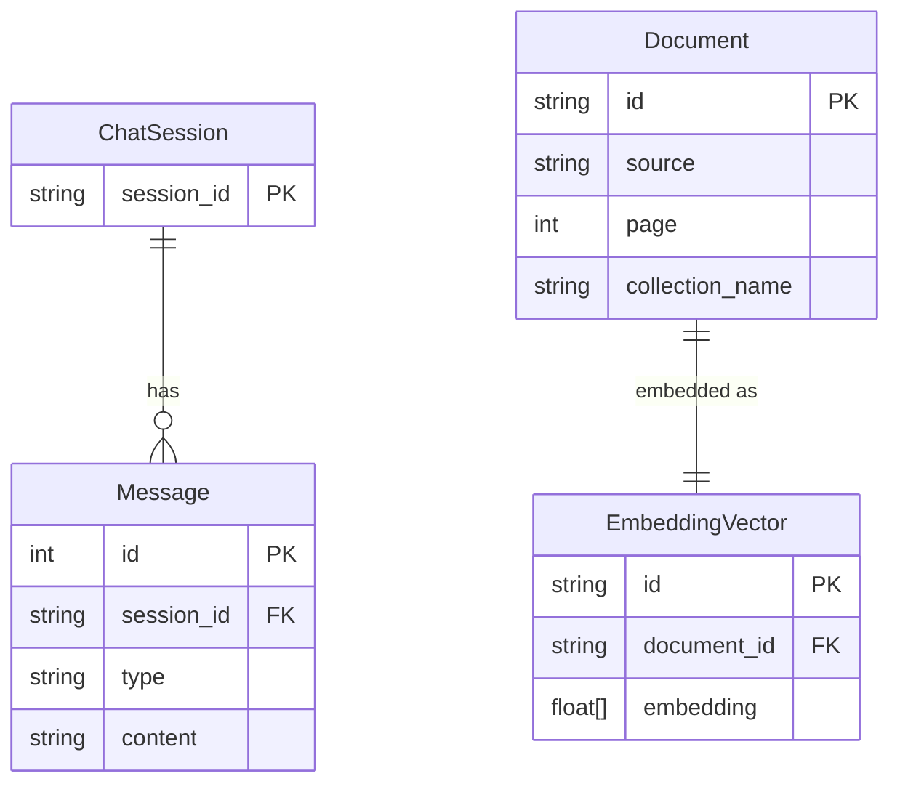

# Data Models

## Entity Relationship Diagram

> **Note:** `Message` and its schema are managed by `SQLChatMessageHistory` (LangChain Community) in `data/chat_history.db`. `Document` and `EmbeddingVector` are managed internally by ChromaDB in `data/chroma_db/`.

---

## Model Descriptions

### ChatRequest (`app/api/routes.py`)

Pydantic model for incoming chat requests.

| Field | Type | Constraints | Description |
|-------|------|-------------|-------------|
| `question` | `str` | min=1, max=2000 | The user's question |
| `session_id` | `str` | min=1, max=100 | Identifies the conversation session |

---

### ChatResponse (`app/api/routes.py`)

Pydantic model for chat responses.

| Field | Type | Constraints | Description |
|-------|------|-------------|-------------|
| `answer` | `str` | — | LLM-generated answer |
| `sources` | `list[str]` | deduplicated | Source filenames of retrieved chunks |

---

### Message (`app/api/routes.py`)

Pydantic model for history entries returned by `GET /history/{session_id}`.

| Field | Type | Constraints | Description |
|-------|------|-------------|-------------|
| `role` | `str` | `"user"` or `"assistant"` | Who sent the message |
| `content` | `str` | — | Message text |

---

### Settings (`app/core/config.py`)

Pydantic-settings model loaded from `.env` at startup.

| Field | Type | Default | Description |
|-------|------|---------|-------------|
| `LLM_PROVIDER` | `Literal["gemini","ollama"]` | `"gemini"` | Active LLM/embeddings provider |
| `GOOGLE_API_KEY` | `str \| None` | `None` | Required when `LLM_PROVIDER=gemini` |
| `GEMINI_MODEL_NAME` | `str` | `"gemini-2.5-flash-lite"` | Gemini LLM model ID |
| `GEMINI_EMBEDDINGS_MODEL` | `str` | `"models/text-embedding-004"` | Gemini embeddings model ID |
| `OLLAMA_BASE_URL` | `str` | `"http://localhost:11434"` | Ollama server URL |
| `OLLAMA_MODEL` | `str` | `"mistral"` | Ollama LLM model name |
| `OLLAMA_EMBEDDINGS_MODEL` | `str` | `"nomic-embed-text"` | Ollama embeddings model name |
| `CHROMA_PERSIST_DIRECTORY` | `str` | `"./data/chroma_db"` | ChromaDB persistence path |
| `PHOENIX_PROJECT_NAME` | `str` | `"rag-lab"` | Arize Phoenix project label |
| `RETRIEVER_K` | `int` | `5` | Number of chunks retrieved per query |
| `LLM_TEMPERATURE` | `float` | `0.7` | LLM sampling temperature |
| `CHUNK_SIZE` | `int` | `1000` | Document chunk size in characters |
| `CHUNK_OVERLAP` | `int` | `200` | Overlap between consecutive chunks in characters |

A `@model_validator` enforces that `GOOGLE_API_KEY` is set when `LLM_PROVIDER=gemini`.

---

### SQLite — `message_store` table (managed by LangChain)

Stored in `data/chat_history.db` via `SQLChatMessageHistory`.

| Field | Type | Description |
|-------|------|-------------|
| `id` | `int` (PK, autoincrement) | Row identifier |
| `session_id` | `str` | Groups messages by conversation session |
| `type` | `str` | LangChain message type (`human`, `ai`, etc.) |
| `content` | `str` | Serialized message content (JSON) |

---

### ChromaDB — `rag_collection`

Stored in `data/chroma_db/`. Each entry corresponds to a document chunk.

| Field | Type | Description |
|-------|------|-------------|
| `id` | `str` (UUID) | Auto-generated chunk identifier |
| `embedding` | `float[]` | Dense embedding vector from active provider |
| `document` | `str` | Raw text content of the chunk |
| `metadata.source` | `str` | Original filename (used to populate `ChatResponse.sources`) |
| `metadata.page` | `int` | Page number (PDF only) |

---

## Data Lifecycle

### Document chunks (ChromaDB)

- **Created:** via `POST /ingest` → `process_file()` → `add_documents_to_store()`. The file is loaded, split with `RecursiveCharacterTextSplitter`, embedded, and inserted into the `rag_collection` collection.
- **Read:** on every `POST /chat`, the retriever performs a similarity search (`k=RETRIEVER_K`) against the stored embeddings.
- **Updated:** not supported — ingesting the same file again appends new chunks.
- **Deleted:** no delete endpoint. Manual removal requires clearing the `data/chroma_db/` directory.

### Chat messages (SQLite)

- **Created:** automatically by `RunnableWithMessageHistory` after each successful `POST /chat` invocation — one `HumanMessage` and one `AIMessage` per exchange.
- **Read:** by `GET /history/{session_id}` and at the start of each `POST /chat` to build the prompt's `chat_history`.
- **Updated:** never — messages are append-only.
- **Deleted:** no delete endpoint. Manual removal requires deleting or truncating `data/chat_history.db`.
