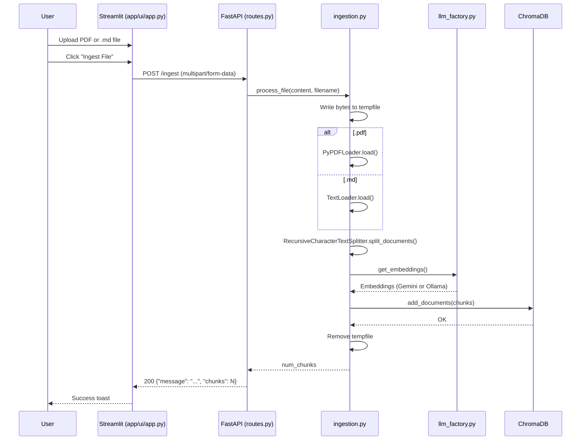
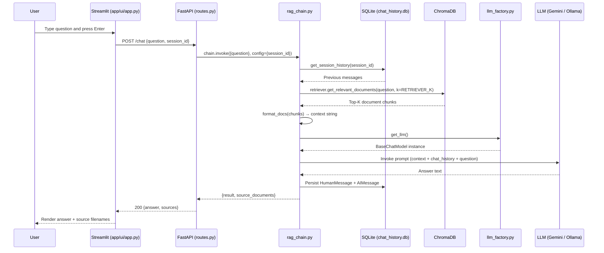
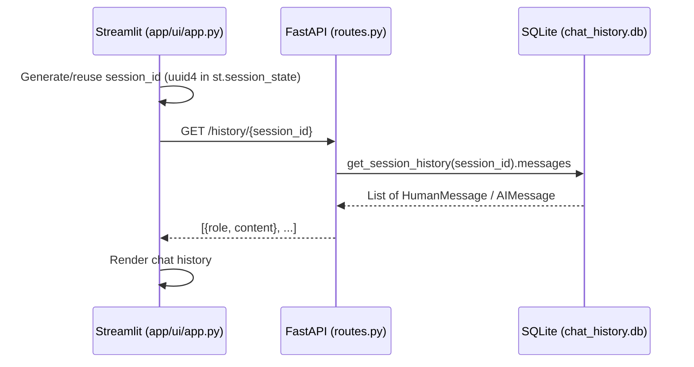
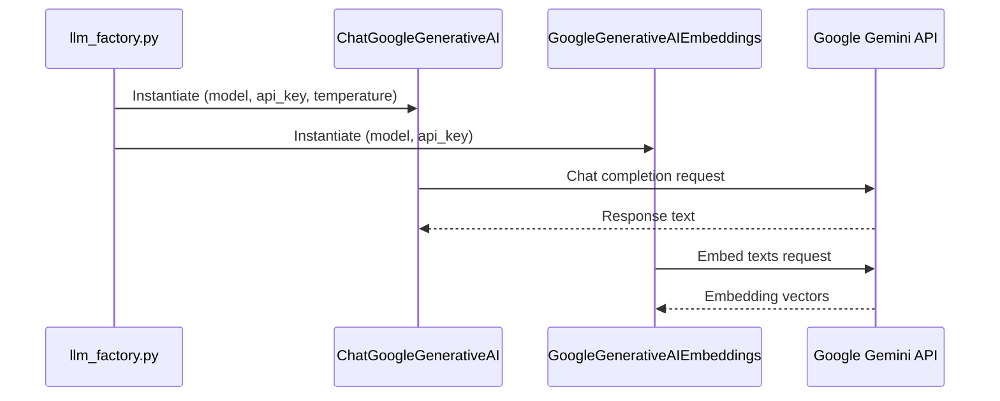
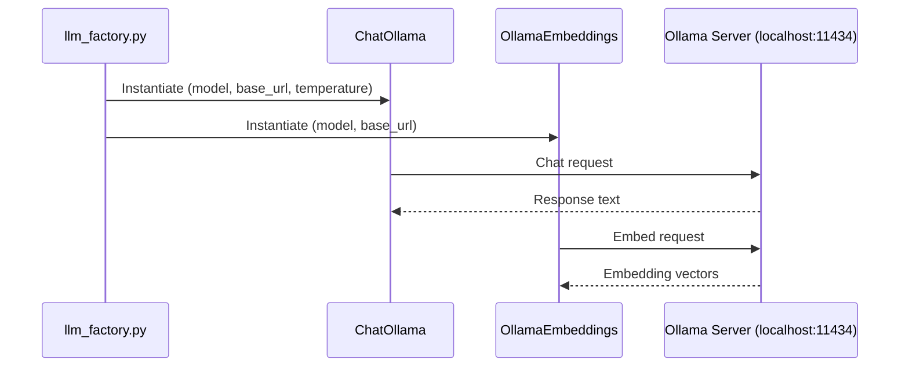

# System Flows

## Core Flows

### 1. Document Ingestion

---

### 2. Chat (RAG Query)

---

### 3. Session History Load (on page load)

---

## External Integrations

### Google Gemini API

Active when `LLM_PROVIDER=gemini`. Requires `GOOGLE_API_KEY`. Default models: `gemini-2.5-flash-lite` (LLM) and `models/text-embedding-004` (embeddings).

### Ollama (Local)

Active when `LLM_PROVIDER=ollama`. Requires a running Ollama server. Default models: `mistral` (LLM) and `nomic-embed-text` (embeddings).

### Arize Phoenix (Optional Tracing)

Phoenix is instrumented via OpenTelemetry at API startup in `app/api/main.py`. If the Phoenix server is not reachable, the exception is caught and the API starts without tracing. No data flows through Phoenix during normal operation — it only receives telemetry spans from LangChain calls.

---

## State Management

### Frontend (Streamlit)

Streamlit uses `st.session_state` for in-memory state within a browser tab:

| Key | Type | Purpose |
|-----|------|---------|
| `session_id` | `str` (UUID4) | Stable identifier for this chat session, generated once per page load |
| `messages` | `list[dict]` | Local copy of the chat history rendered in the UI |

On first load, `messages` is populated by calling `GET /history/{session_id}`, so conversations persist across page refreshes.

### Backend (FastAPI)

The API is stateless — no in-memory session state. All persistence is delegated to:

- **ChromaDB** (`data/chroma_db/`): stores document embeddings, persisted to disk between restarts.
- **SQLite** (`data/chat_history.db`): stores per-session chat messages via `SQLChatMessageHistory`. Created automatically on first use.
